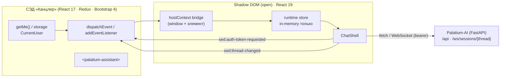
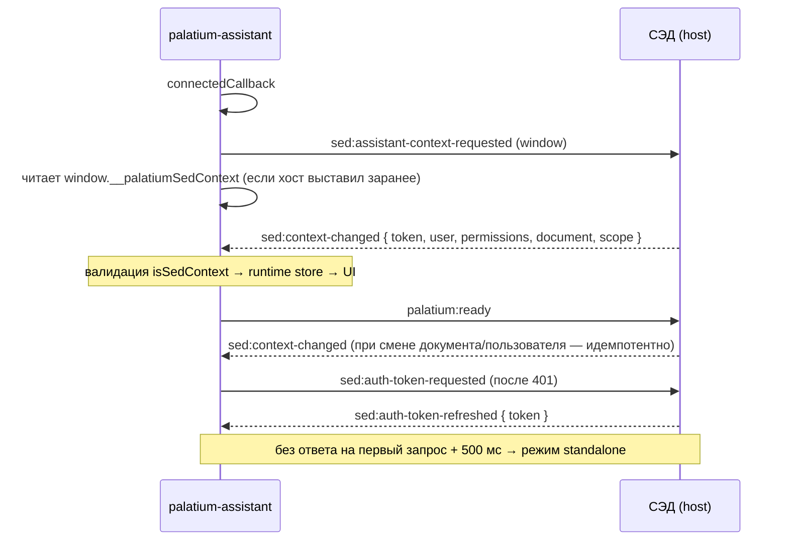

# Embeddable-ассистент `<palatium-assistant>`

Durable-документ для команды СЭД «Канцлер NEXT»: контракт встраиваемого виджета.
Норматив — `.cursor/rules/` (020, 030, 060, 070, 084); план и статус волн — `.cursor/plans/web-embed-assistant.md`.
Источник истины по типам — `web/packages/contract/src/index.ts` и машинный манифест `web/custom-elements.json`.

## 1. Границы

Виджет — самодостаточный Custom Element со своим React 19 runtime внутри Shadow DOM.
Он **не** переиспользует React хоста (СЭД на React 17), не читает `localStorage`/`sessionStorage`/cookie и не перезагружает
страницу-хост. Один статический файл, ноль внешних сетевых запросов за шрифтами и ассетами.



## 2. Публичный API элемента

Подключается одним `<script src="palatium-assistant.iife.js">`; регистрация тега выполняется самим бандлом.

| Канал | Имя | Семантика |
|---|---|---|
| Атрибут | `lang` | BCP-47 интерфейса и форматирования; перекрывает `user.localization` из контекста |
| Атрибут | `collapsed` | Только чтение: панель свёрнута. Зеркало `close()`; выставлять вручную не нужно |
| Атрибут | `data-theme="light"` | Светлая тема (opt-in). Отсутствует — тёмная тема по умолчанию |
| Метод | `setContext(ctx)` | Контекст напрямую; невалидный payload → `TypeError` |
| Метод | `open()` / `close()` | Развернуть / свернуть панель (чат не размонтируется — история и HITL-карточки сохраняются) |
| Событие (наружу) | `palatium:ready` | Элемент апгрейдился и готов принимать контекст (`bubbles`, `composed`) |
| Событие (наружу) | `sed:thread-changed` | `{ threadId }` — тред диалога; сохраните id и верните его в `SedContext.threadId`, иначе перезагрузка страницы СЭД сотрёт диалог (§9.2.2) |

CSS-части для стилизации хостом: `launcher`, `shell`, `header`, `transcript`, `composer`, `close`.

```html
<palatium-assistant id="assistant" lang="ru"></palatium-assistant>
<script src="/static/palatium-assistant.iife.js"></script>
<script>
  document.getElementById('assistant').setContext(context);
</script>
```

## 3. Handshake контекста

Контекст **не** читается виджетом из хранилища СЭД — хост отдаёт его событием. Handshake двусторонний, потому что
односторонний «жди 500 мс» ломается на гонке: СЭД может отправить контекст до `customElements.define`, и событие потеряется.



- Виджет слушает и `window`, и собственный элемент — принимаются оба способа доставки.
- `sed:context-changed` при смене документа/пользователя обрабатывается **без перезагрузки** страницы СЭД.
- `SedContext.threadId` (необязательное поле, 1…128) — тред, который host уже ведёт; виджет продолжает его
  после перезагрузки страницы. Контекст **без** поля тред не сбрасывает: host вправе слать контекст часто
  (смена документа, перерисовка) и не обязан повторять тред каждый раз. Сброс — только явный «Новый диалог».
  Как host узнаёт id — §9.2.2.
- Приватность: токен живёт в памяти модуля, не логируется и не попадает ни в storage, ни в URL (кроме запроса WS,
  где `?token=` — существующий контракт бэкенда Palatium-AI, не СЭД).

## 4. Темизация

Два рычага; оба не требуют правок виджета.

1. **Токены** — CSS custom properties. Полный перечень и значения по умолчанию — `web/src/tokens.css`. Хост переопределяет
   их на своём уровне (`palatium-assistant { --accent: #0b6b52; }`) или через дизайн-токены СЭД.
2. **Части** — `::part(...)` для зон, которые реально различаются между продуктами; интерьер наружу не отдаётся.

```css
palatium-assistant::part(launcher) { background: #123024; border-radius: 12px; }
```

Переключение светлой темы — **opt-in**, а не по `prefers-color-scheme`: последний отражает настройку ОС пользователя,
а не тему приложения-хоста, и дал бы тёмный виджет в светлом СЭД. СЭД выставляет атрибут:

```html
<palatium-assistant data-theme="light"></palatium-assistant>
```

## 5. Язык и локаль

- Порядок разрешения: атрибут `lang` → `user.localization` из контекста (enum `RU|EN|GE`) → `ru-RU`.
- Если host **дал** `localization`, язык браузера не используется вовсе: он принадлежит чужой странице и
  разошёлся бы с интерфейсом вокруг. `GE` ресурсов не имеет и у самого СЭД (`frontend/gtb/src/i18n.js` знает
  только `RU`/`EN`, `fallbackLng` = RU), поэтому для неё виджет берёт `ru-RU` — то же, что показывает host.
  Язык браузера остаётся источником только когда контекста нет вообще (`standalone.html`, dev).
- **Если СЭД когда-нибудь добавит ресурсы для `GE`** — задайте язык атрибутом `lang` на элементе: он имеет
  приоритет над контекстом и применяется вживую. Это единственный рычаг, контракт менять не нужно.
- Словари RU/EN входят в бандл целиком (single-file IIFE не может code-split'иться). Пропущенный перевод — ошибка
  компиляции: `Record<MessageKey, string>` требует все ключи.
- Числа и даты форматируются слоем локали (`web/src/i18n`: `formatNumber` / `formatDateTime`), а не
  `toLocaleString()`/`toFixed()` на месте. Формат следует **разрешённому языку и его локали**
  (`ru-RU` / `en-US`; региональный вариант поддерживаемого языка сохраняется — `en-GB` остаётся `en-GB`),
  поэтому внутри русской страницы СЭД карточка не покажет `3:45:12 PM`: локаль **браузера** здесь не источник
  (регрессия — `e2e/host.spec.ts`). Число знаков — часть формата, а не локали: у `risk_score` их два (`0,81`),
  у размера вложения — один (`1,5 MB`).
- **Обращение по имени** берётся только из контекста: `firstName`, если host его прислал, иначе `fullName`
  как есть (`preferredName` в контракте). Порядок слов в `fullName` виджет не разбирает: в СЭД это обычно
  «Фамилия Имя», и разбор по позиции дал бы обращение по фамилии. Хотите имя в обращении — заполните
  `user.firstName`; поля нет или оно пустое — приветствие выводится без имени, а не «Здравствуйте, ».

## 6. Доставка

| Артефакт | Где | Примечание |
|---|---|---|
| Бандл | `web/dist-widget/palatium-assistant.v<version>.<hash>.iife.js` | Single-file IIFE, `target: es2022` (СЭД = Chromium Edge), без `eval` (CSP-дружелюбен) |
| Манифест релиза | `web/dist-widget/release.json` | Версия, имя файла, SRI-дайджест, размеры, политика кэша |
| CEM | `web/dist-widget/custom-elements.json` (источник — `web/custom-elements.json`) | Контракт элемента для IDE и тулингов; входит в артефакт |
| Стенд | `web/standalone.html` | Разработка без СЭД: мок-хост, `close()`/`open()`, темы, `::part()` |

### Имя, кэш, SRI

Имя артефакта — `palatium-assistant.v<semver>.<content-hash>.iife.js`. Контент-хеш делает файл
иммутабельным: обновление виджета меняет URL, поэтому можно кэшировать навсегда.

```http
Cache-Control: public, max-age=31536000, immutable
```

SRI-дайджест (`sha384`) лежит в `release.json`; хост вписывает его в тег скрипта:

```html
<script
  src="/static/palatium-assistant.v0.1.0.BwDWNccK.iife.js"
  integrity="sha384-SUheDs5soIaSD9ktQtGb7sUnnp3kD2uewtZAn2OXzYsslYcQPXujca1d3rLSHD0a"
  crossorigin="anonymous"
></script>
```

Проверка скачанного файла — обычным дайджестом, исходники для этого не нужны:

```bash
openssl dgst -sha384 -binary palatium-assistant.v0.1.0.BwDWNccK.iife.js | openssl base64 -A
# сверить с полем "integrity" в release.json (без префикса sha384-)
```

### Сборка и гейты

```bash
npm --prefix web ci                # установка (как в CI)
npm --prefix web run typecheck     # типы виджета + контракта
npm --prefix web run cem:check     # манифест CEM не разошёлся с исходником
npm --prefix web run build:widget  # сборка + бюджет gzip + SRI + валидация CEM
npm --prefix web run verify:widget # дайджест в release.json совпадает с бандлом
npm --prefix web run test:e2e      # E2E + a11y (Playwright; backend не нужен)
npm --prefix web run test:a11y     # только доступность и клавиатура
npm --prefix web run test:shots    # кадры обеих тем для глаз человека (web/.shots/)
```

Те же шаги выполняет CI-job `frontend` (`.github/workflows/ci.yml`); оттуда же публикуется артефакт
`palatium-assistant-widget` (бандл + `release.json` + `custom-elements.json`) и отчёт Playwright
(`playwright-report`) — в том числе при падении, иначе разбирать нечего.

E2E идёт против `standalone.html` (dev-сервер Vite, порт 5174) и **не требует backend**: все `/api/**`
и `/ws/sessions/**` перехватываются моками (`web/e2e/mock-server.ts`), неизвестный эндпоинт = 404 и
падение теста. 49 тестов в шести наборах (45 исполняются, 4 кадра — по запросу): `state-matrix.spec.ts`
(15 состояний UI как явный артефакт), `interaction.spec.ts` (проводной контракт: тела, заголовки, отсутствие
tenant-заголовка, повторы, 401), `contract.spec.ts` (граница доверия: согласованность tenant'а и закрытый
каталог действий), `endpoints.spec.ts` (адреса REST и WS выводятся из одной базы — топология §9.1),
`host.spec.ts` (атрибуты хоста: `lang` переключает интерфейс вживую; локаль при `GE` — язык host'а, а не
браузера; форматы чисел и дат следуют языку host'а, а не языку браузера; обращение по имени берётся из
контекста; непрерывность диалога — тред host'а продолжается, свой тред объявляется, эха нет; отказ от чужого
tenant'а и приём согласованного контекста), `a11y.spec.ts`
(axe WCAG A/AA в обеих темах, Tab и видимый focus внутри Shadow DOM, клавиатурная активация HITL,
reduced motion).

Свой скрипт `web/scripts/widget-release.mjs` вместо плагина: SRI считается по готовому файлу, поэтому
его нельзя посчитать внутри сборки; заодно одним проходом проверяются бюджет, валидность CEM и версия.

- **Бюджет:** 150 KiB gzip. Текущий замер — 142.44 KiB (95.0%, запас ~7.6 KiB gzip). Превышение роняет сборку;
  поднять бюджет = осознанное решение с обновлением плана, а не правка «чтобы CI был зелёным». Запас
  исчерпывается: следующая фича в рантайме (без выноса кода) потребует этого решения.
- **Воспроизводимость:** четыре независимых сборки (в т.ч. после чистого `npm ci`) дали один и тот же дайджест.
- **Конструктор стилей:** `CSSStyleSheet` + `adoptedStyleSheets` (одна таблица на все экземпляры). Именно
  поэтому виджет не требует `style-src 'unsafe-inline'` и не нуждается в nonce: constructed stylesheet не
  проходит через парсер стилей документа, а CSP покрывает `<style>`/`style=`/`<link rel=stylesheet>`.
  Атрибута `csp-nonce` у элемента нет и не планируется — требование к хосту только одно: разрешить
  `connect-src` на origin API и объектного хранилища (§9.7).
- **Порядок строк:** `.gitattributes` фиксирует `web/**` как LF. Это не стилистика: `custom-elements.json`
  встраивает JSDoc из `src/widget.tsx` дословно вместе с переводами строк, поэтому при `core.autocrlf=true`
  регенерация манифеста давала бы другие байты и гейт `cem:check` падал бы локально при зелёном CI.

## 7. Инварианты (нарушение = дефект, а не «стиль»)

- Токен, `thread_id`, `trace_id` — **только в памяти**. Ноль `localStorage`/`sessionStorage`/`document.cookie` (grep-гейт).
- Никакого raw HTML из вывода модели: `BlockRenderer` рисует только текстовые узлы, ссылки пропускает `safeHttpHref` (`http`/`https`).
- Виджет не перезагружает страницу-хост (`window.location.reload()` отсутствует).
- Клиентскому набору прав из `SedContext` **не доверяем**: RBAC — на сервере (`ToolExecutor`, правило 070).
- HITL-карточки и история не теряются при сворачивании панели.

## 8. Открытые вопросы к команде СЭД

Всё, что можно решить без СЭД, уже решено и записано в §9; ниже — только то, что требует их ответа.

1. **Топология доступа к API:** reverse proxy на origin СЭД (рекомендуемый вариант, CORS не нужен) или
   абсолютная база + CORS + WSS-allowlist? От этого зависит §9.1 — но не код виджета.
2. **Обработчик `sed:action-requested`.** Каталог действий решён нами и закрыт в контракте
   (§9.2, `AssistantAction`): `open_document`, `navigate` (ключ раздела), `search`. Ключи разделов взяты
   из их же `frontend/gtb/src/constants/content/route.js` (`/document/my-docs`, `/task/my-task`), а не
   выдуманы. От СЭД нужен обработчик (§9.2.1 — скелет для копирования) и маппинг ключ → `*_VIEW_ROUTE`
   с проверкой права на раздел.
   **Производителя события в виджете пока нет, и это не продуктовый вопрос.** `ContentDocument.actions` —
   словарь HITL-карточек, а не операции СЭД (промпт Formatter'а: «actions are specs only; the server turns them
   into clickable HITL cards»). Действие `open_document` требует ссылки на документ СЭД, которой в ответе нет:
   `meta.source_refs` всегда пуст, инструментов с id документов СЭД ещё не заведено (§5 п.16). Значит
   производитель упирается в retrieval/EDMS MCP — те же зависимости, что W10 и W13, и начинается вместе с ними,
   а не отдельным решением продукта.
3. **Требования к токену** (§9.3): алгоритм и ключи стенда Palatium (HS* с общим секретом или RS/ES + JWKS),
   claim `org_id` (или `org`) — он и есть tenant. Без него §9.4-проверка согласованности пропускает контекст
   как «неизвестность»; с чужим значением — отбрасывает. Подтвердить, что СЭД выпускает/пробрасывает именно
   такие токены.
4. **`Localization.GE` — вопрос снят (2026-09-29).** Назвать язык по `GE` нельзя (немецкий `de` или грузинский
   `ka`), но это больше не влияет на виджет: у самого СЭД ресурсов для `GE` нет (`frontend/gtb/src/i18n.js` —
   только `RU`/`EN`, `fallbackLng` = RU), поэтому виджет показывает тот же русский, что и страница вокруг.
   **Если у вас появятся ресурсы для `GE`** — задайте `lang` на элементе (приоритет над контекстом, применяется
   без перезагрузки); менять контракт не нужно.
5. **`thread_id` между перезагрузками страницы СЭД — механика готова (2026-09-30), нужны действия СЭД.** Тред живёт
   только в памяти сессии виджета (storage запрещён, W3), поэтому после F5 диалог начинался бы пустым. Контракт
   закрыт с двух сторон: виджет объявляет тред событием `sed:thread-changed` (`{ threadId }`), host сохраняет id
   у себя и возвращает его в `SedContext.threadId` — тогда виджет продолжает ТОТ ЖЕ диалог (история подтягивается,
   следующий запрос уходит в тот же тред). От СЭД нужно ровно одно: подписка на событие + возврат id (скелет —
   §9.2.2). Атрибут элемента для этого **не** годится: `<palatium-assistant thread-id="…">` — статичная разметка,
   одинаковая для всех пользователей страницы, то есть один тред на всех (утечка диалога, 020).
6. **Достижимость presigned upload URL** вложений из сети СЭД (`PUT` на объектное хранилище — не наш origin).
7. **Роли UUID → имена** (W12): резолвит host / отдельный read-only эндпоинт СЭД / остаёмся на UUID.
8. **OWNERS `web/packages/contract`:** кто владеет контрактом — эта команда или СЭД (правка = обе стороны).

## 9. Интеграционный пакет (W9)

Что именно делает команда СЭД, чтобы виджет заработал на их стенде. Пункты — по возрастанию цены ошибки;
чек-лист приёмки — §9.8.

### 9.1. Адреса: один рычаг на REST и WebSocket

Виджет вычисляет REST и WS из **одного** значения (`web/src/runtime/endpoints.ts`, проверено
`web/e2e/endpoints.spec.ts`): относительная база → оба пути идут на origin страницы СЭД; абсолютная →
оба на её origin, схема сокета выводится из схемы базы (`https` → `wss`).

| Топология | СЭД делает | Плюсы / цена |
|---|---|---|
| **A. Reverse proxy (штатная)** | проксирует `/api/*` и `/ws/sessions/*` (upgrade) на Palatium-AI | CORS не нужен, `wss` на том же сертификате, готово к BFF с cookie |
| **B. Абсолютная база** | `VITE_API_BASE_URL=https://palatium.example/api` при сборке + CORS для origin СЭД + WSS-allowlist | правки в СЭД не нужны, но появляются два cross-origin периметра |

- База запекается в артефакт на сборке: смена топологии = пересборка виджета (не «настройка на месте»).
- Токен сокета — в query (`?token=…`): браузер не отдаёт заголовки в WebSocket. Это контракт бэкенда
  Palatium-AI, а не СЭД; в storage токен при этом не попадает (§7).
- Прокси обязан сохранять `Authorization`, `X-Trace-Id` и тело запроса как есть; переписывание путей
  (`/api` → `/palatium/api`) поддержано, но требует такой же базы при сборке.

### 9.2. События: две стороны, шесть имён

Имена и формы — в `@palatium/contract` (`SED_EVENTS`, `SedContext`, `isSedContext`). Строковые литералы в
коде любой из сторон запрещены: опечатка в имени события не падает, а молча отключает интеграцию.

| Направление | Событие | Detail | Когда |
|---|---|---|---|
| СЭД → виджет | `sed:context-changed` | `SedContext` (обязательны `token`, `user.id`, `user.orgId`, `scope.tenantId`, `scope.departmentIds`) | при `sed:assistant-context-requested`, при смене пользователя/документа/локали |
| СЭД → виджет | `sed:auth-token-refreshed` | `{ token }` | в ответ на `sed:auth-token-requested` (§9.3) |
| виджет → СЭД | `sed:assistant-context-requested` | — | один раз при подключении элемента |
| виджет → СЭД | `sed:auth-token-requested` | — | после `401`, не чаще одного раза на серию (§9.3) |
| виджет → СЭД | `sed:thread-changed` | `{ threadId }` | виджет создал новый тред (`Новый диалог`) или объявил текущий после рукопожатия; **host обязан сохранить id** и вернуть его в `SedContext.threadId` (§9.2.2) |
| виджет → СЭД | `palatium:ready` | — | элемент апгрейдился и готов принимать контекст |
| виджет → СЭД | `sed:action-requested` | `AssistantAction` (закрытый каталог ниже) | каталог зафиксирован и валидируем; **виджет пока не эмитит** — в ответе нет ссылок на документы СЭД (§9.2.1) |

**Каталог действий закрыт** (`AssistantAction` в `@palatium/contract`, разбор detail — только
`isAssistantAction`). Сырой `payload: Record<string, unknown>` в контракте отсутствует намеренно: сырой
dict на границе = потеря типобезопасности и дрейф между командами (050). Новый вариант = правка union обеими
командами (005).

| Действие | Поля | Что делает СЭД | HITL |
|---|---|---|---|
| `open_document` | `documentId` (суррогатный id документа) | открывает карточку (`DOCUMENT_FORM_ROUTE/:id`); вкладку не задаём — открывается вкладка по умолчанию | не требуется (обратимо) |
| `navigate` | `view` ∈ `home` \| `my_documents` \| `my_tasks` | переход в раздел: `HOME_PAGE_ROUTE` / `MY_DOCS_VIEW_ROUTE` / `MY_TASK_VIEW_ROUTE` | не требуется |
| `search` | `query` | открывает `SEARCH_ROUTE` с заполненным запросом | не требуется |

- `view` — **ключ, а не путь**: маршруты принадлежат СЭД (`frontend/gtb/src/constants/content/route.js`) и
  меняются без нас. Принимать от ассистента произвольный путь нельзя — это навигационный open-redirect в
  чужом UI; поэтому перечень ключей закрыт, а host сам отображает ключ в свой `*_VIEW_ROUTE` и проверяет право.
- `requiresConfirmation` входит в форму события, но сегодняшний каталог обратим: флаг — контрактная
  возможность для будущих необратимых просьб (020), а не текущее поведение.
- Решение принимает host: он вправе отклонить любую просьбу (нет права, раздел недоступен). Виджет не
  считает переход выполненным, пока не увидит `sed:context-changed` или новый `document`.

#### 9.2.1. Кто производит действие и что делать СЭД

Две независимые части; для включения события нужны обе, но вторая не блокируется первой:

1. **Производитель в виджете — пока отсутствует, и это не «свободный выбор продукта».** Документ ответа
   (`ContentDocument`) несёт поле `actions` (`ActionSpec`), но это **словарь HITL-карточек**, а не операции СЭД:
   в промпте Formatter'а прямо сказано «actions are specs only; the server turns them into clickable HITL cards»,
   а `ActionKind` (`approve`/`reject`/`confirm`/`dismiss`/`custom`/`format`) — закрытый enum платформы, тот же,
   что у карточек. Подставлять его под `AssistantAction` — смешать две оси (055) и выдумать контракт (090).
   Настоящий источник — **ссылки на документы СЭД в ответе**: `open_document` требует `documentId`, а взять его
   сегодня неоткуда — `meta.source_refs` во всём пайплайне всегда пуст (`formatter/agent.py`, `nodes.py`), а
   инструментов, возвращающих id документов СЭД, ещё нет (§5 п.16). То есть производитель упирается в те же
   зависимости, что W10/W13 (retrieval + EDMS MCP), а не в наше решение о UX.
2. **Обработчик в СЭД — реализуется по образцу ниже, и делать его можно уже сейчас.** Он не зависит от нашего
   производителя: контракт и валидатор зафиксированы, поэтому интеграцию со стороны СЭД можно написать и
   проверить синтетическим `dispatchEvent` до первого настоящего вызова.

Скелет обработчика на стороне СЭД (`isAssistantAction` — из `@palatium/contract`; маппинг ключей — их
константы `route.js`, проверка права на раздел — их RBAC):

```js
const VIEW_ROUTES = {
  home: HOME_PAGE_ROUTE,                 // '/home-page'
  my_documents: MY_DOCS_VIEW_ROUTE,      // '/document/my-docs'
  my_tasks: MY_TASK_VIEW_ROUTE,          // '/task/my-task'
};

window.addEventListener('sed:action-requested', event => {
  const action = event.detail;
  // detail приходит со страницы, куда может писать кто угодно: только валидация, не `as`.
  if (!isAssistantAction(action)) return;
  switch (action.action) {
    case 'open_document':
      history.push(`${DOCUMENT_FORM_ROUTE}/${encodeURIComponent(action.documentId)}`);
      break;
    case 'navigate':
      history.push(VIEW_ROUTES[action.view]);
      break;
    case 'search':
      history.push({ pathname: SEARCH_ROUTE, state: { query: action.query } });
      break;
  }
});
```

`action.view` — уже провалидированный ключ из закрытого перечня, поэтому `VIEW_ROUTES[action.view]` не может
быть `undefined`; `documentId` и `query` экранируются (значения приходят из текста ответа ассистента).

Обязательства обеих сторон:

- СЭД отвечает на **оба** запроса виджета — иначе виджет уходит в автономный режим (`500 мс`) или в ошибку
  обновления токена (`5 с`).
- События принимаются и на `window`, и на самом элементе: виджет слушает оба, host может слать на любой из них.
- Невалидный `detail` отбрасывается молча (`isSedContext`) и рендер не роняет: на странице СЭД в
  `CustomEvent` может отправить данные кто угодно.
- Смена документа не перезагружает страницу и не теряет диалог: `sed:context-changed` идемпотентен.
- До загрузки скрипта контекст можно положить в `window.__palatiumSedContext` (гонка с `customElements.define`).

Минимальный host для копирования — мок-хост в `web/standalone.html` (~60 строк: `buildContext()`, три
listener'а, две кнопки). Это референс, а не пример «для разработки»: он реализует ровно тот контракт, что в
таблице выше, — контекст, refresh, тред (§9.2.2) и чтение согласованности tenant'а; обработчик
`sed:action-requested` в него намеренно не добавлен, потому что производителя события в виджете ещё нет
(§9.2.1), а listener без источника событий — мёртвый код. Образец обработчика для СЭД — в §9.2.1.

#### 9.2.2. Тред диалога: кто его хранит и как вернуть

Тред — короткая строка (`1…128`, проверяется `normalizeThreadId` из `@palatium/contract`), которой адресуются
история (`GET /api/sessions/{thread_id}/turns`) и WS-подписка. Виджет держит его **только в памяти** (storage
запрещён, W3), поэтому единственный, кто может пережить перезагрузку страницы, — host. Обмен ровно в две строки:

```js
// 1) Виджет объявил тред — сохраните его у себя (state, sessionStorage, БД — ваш выбор).
window.addEventListener('sed:thread-changed', event => {
  saveThreadId(event.detail.threadId);
});

// 2) Верните его в следующем контексте — виджет продолжит тот же диалог.
function buildContext() {
  return {
    token, user, permissions, document, scope,
    ...(savedThreadId ? { threadId: savedThreadId } : {}),
  };
}
```

Что важно понимать:

- **Поле необязательное, и его отсутствие тред не сбрасывает.** Контекст приходит часто (смена документа,
  перерисовка layout) — если бы каждое такое событие начинало новый диалог, виджет был бы непригоден. Сброс
  треда делает только пользователь кнопкой «Новый диалог», и об этом host узнаёт тем же `sed:thread-changed`.
- **Эха не будет.** Если id пришёл от host'а, виджет его обратно не объявляет: host уже знает значение, а
  лишнее событие заставило бы его обновлять состояние на каждое рукопожатие.
- **До конца рукопожатия (500 мс) виджет молчит.** Если СЭД успевает ответить на `sed:assistant-context-requested`
  со своим `threadId`, объявления своего треда не произойдёт — иначе host получил бы два разных id на один запуск.
- **Порядок при старте:** сохранённый тред можно не передавать — виджет объявит свой, и вы его сохраните;
  передавать `threadId` нужно, чтобы **продолжить** прошлый диалог.
- **Атрибут элемента для треда не предусмотрен** — намеренно: `thread-id="…"` в разметке одинаков для всех
  пользователей страницы, то есть один диалог на всех. Значение — только через контекст, то есть per-user.
- **Это id, а не право.** Владельца проверяет сервер (`GET /turns` и WS возвращают отказ/пустоту для чужого
  тредa), поэтому подставленный извне id не открывает чужие данные (020).

Проверить на стенде: отправить сообщение → перезагрузить страницу СЭД → context с сохранённым `threadId` →
история на месте, следующее сообщение уходит в тот же тред.

### 9.3. Токен: жизненный цикл

```mermaid
sequenceDiagram
  participant H as СЭД
  participant W as виджет
  W->>H: sed:assistant-context-requested
  H-->>W: sed:context-changed { token, ... }
  Note over W: токен в памяти модуля (без storage)
  W->>W: 401 на /api/* → sed:auth-token-requested (один на серию параллельных 401)
  H-->>W: sed:auth-token-refreshed { token }
  W->>W: ровно один повтор исходного запроса
  Note over H,W: нет ответа 5 с → ошибка обновления; нет контекста 500 мс → автономный режим
```

- Виджет **не** обновляет токен сам: `POST /api/auth/dev-token` в host-режиме запрещён (обход модели доступа СЭД).
- Параллельные `401` дедуплицируются в один запрос к host'у: шторм 401 не превращается в шторм событий.
- Повтор после обновления — ровно один (иначе три таймаута подряд при мёртвом refresh).
- Сеть и `5xx` повторяются (2 повтора с растущей паузой), `4xx` — нет: ошибка ввода не лечится повтором.
- Перезагрузка страницы СЭД стирает токен (он только в памяти) — host обязан снова ответить на
  `sed:assistant-context-requested`; иначе это не ошибка виджета, а отсутствие контекста с его стороны.
- Автономный режим (нет контекста за 500 мс) — режим **разработки**, а не второй способ авторизации: вне
  `development` эндпоинт `/api/auth/dev-token` отдаёт `404`, и виджет покажет ошибку токена. Хосту не нужно
  его «включать» — нужно ответить контекстом.

**Требования к токену** (бэкенд Palatium проверяет сам; виджет читает только `org_id` для §9.4):

| Требование | Почему |
|---|---|
| Выпущен стендом Palatium (`HS*` с общим секретом либо `RS`/`ES` + `JWKS`), не самописный | подпись проверяет `presentation/security/jwt.py`; алгоритм — ОДИН, из конфига; иначе каждый запрос = `401` |
| Обязательные claims: `sub` (непустой), `exp` | `options={"require": ["exp", "sub"]}` — без них токен отклоняется |
| `iss` / `aud` — если заданы в конфиге Palatium | при `JWT_ISSUER`/`JWT_AUDIENCE` они проверяются; при пустых значениях — не проверяются вовсе |
| `org_id` (допустим `org`) = tenant пользователя | из него берётся tenant-изоляция памяти; при расхождении с `scope.tenantId` контекст отбрасывается (§9.4) |
| При step-up-сценариях — `acr`/`amr` и claim привязки карточки | `infrastructure/hitl/idp_acr_step_up.py` проверяет их, а не только подпись |
| Короткий TTL + обновление по `sed:auth-token-requested` | токен живёт в памяти: после F5 нужен новый контекст (таблица выше) |

`roles` (или `role`, или Keycloak-овский `realm_access.roles`) уходят в `AuthPrincipal.roles` — на tenant не
влияют; `SedContext.permissions.roles` — UUID из `getMe()`, отдельная ось (§9.4).

### 9.4. Tenant, права, PII

- **Tenant берётся только из валидированного токена** (`principal.org_id` на бэкенде). `x-organization`
  виджет не отправляет и **не должен** — это зафиксировано тестом (`interaction.spec.ts`: все вызовы, включая
  host-режим, обязаны иметь заголовок `null`). Поле `org_id` в теле запроса роутер игнорирует явно.
  Клиентский заголовок создал бы второго «начальника» рядом с JWT — то, чего Zero Trust не допускает.
- **Контекст, где tenant'ы расходятся, отбрасывается** (`checkTenantConsistency` в `@palatium/contract`,
  `web/src/lib/hostContext.ts`): сверяются `scope.tenantId`, `user.orgId` и tenant из токена. При расхождении
  сервер обслуживал бы tenant из токена, а UI показывал бы пользователя/документ другого — тихая кросс-tenant
  путаница вместо ошибки. Поведение fail-closed (035): контекст не применяется, окно автономного режима
  продолжает идти, пользователь видит понятное сообщение; `setContext()` в этом случае бросает `TypeError`.
  Токен без tenant-claim (dev-токен) даёт вердикт «неизвестно» и не блокирует подключение.
- `SedContext.permissions` — **только UX** и наверх не передаётся. Сегодня виджет из него ничего не читает:
  `authorities`/`roles`/`archivist`/`fired` приходят, но в UI не влияют. Гейты по ним — серверные и стоят
  в платформе (W10: `fired` → отказ запуска, `archivist` → read-only allow-list), в виджете UI-флаг
  не является защитой (020). Маппинг полей из `getMe()` СЭД (`CurrentUser`): `authorities` ← набор
  `GrantedAuthority` (константы enum `Permission`), `roles` ← `Set<UUID>`, `subordinatesDepartments` /
  `responsibleNomenclatureDepartmentIds` ← одноимённые поля, `archivist`/`fired` ← булевы флаги.
- PII (ФИО, заголовки документов) попадает в промпты и в память: запись в память проходит через HITL-карточку,
  классификация `contains_pii` и правило забывания — на стороне платформы (060).

### 9.5. Монтаж и место в UI

Виджет — обычный inline-элемент: позиционирование, размер и «место в интерфейсе» задаёт CSS СЭД
(в Shadow DOM нет ни `position: fixed`, ни `z-index` — это сознательно, иначе виджет диктовал бы layout хосту).

```html
<!-- 1. Один раз: скрипт + элемент. Элемент можно перемещать по DOM — React-root не пересоздаётся. -->
<script src="/static/palatium-assistant.v0.1.0.<hash>.iife.js"
        integrity="sha384-…" crossorigin="anonymous"></script>
<palatium-assistant id="assistant" lang="ru" data-theme="light"></palatium-assistant>

<script>
  const assistant = document.getElementById('assistant');

  // 2. Контекст: при mount и при переходах внутри СЭД.
  assistant.setContext(context);            // либо событие sed:context-changed, если элемент переиспользуется

  // 3. Место в UI — три поддерживаемых шаблона, DOM один и тот же:
  assistant.open();  assistant.close();     // панель ↔ лончер
  document.getElementById('assistant').addEventListener('palatium:ready', () => assistant.setContext(context));
</script>
```

| Шаблон | Как | Что стилизует СЭД |
|---|---|---|
| Плавающая кнопка + панель | контейнер `position: fixed` вокруг элемента, `open()`/`close()` | `::part(launcher)`, координаты контейнера |
| Боковая панель | элемент в layout-колонке СЭД, атрибут `[collapsed]` как зеркало для их CSS | ширину/высоту колонки, `::part(header)` |
| Отдельная страница/диалог | элемент на весь контейнер, `open()` при входе | размеры страницы, токены темы |

**Инварианты, которые СЭД не должна нарушать:** не выставлять `collapsed` «для синхронизации» (источник
истины — runtime-состояние виджета, атрибут — зеркало для их CSS; `data-theme`, наоборот, ставит только
хост), не перезагружать страницу для нового диалога (сброс — кнопкой внутри виджета, публичного метода
`startNewThread` у элемента нет), не читать токен из DOM/URL.

### 9.6. Canary и feature-flag

- Раскатка — на стороне СЭД: флаг по `authorities`/списку пользователей определяет, добавлять ли `<script>`
  и элемент. Виджет флага не знает и знать не должен.
- Откат — снять скрипт (или не рендерить элемент). Кэш чистить не нужно: имя файла содержит контент-хеш,
  выкладка новой версии = новый URL (§6).
- `SRI` в теге скрипта обязателен: подмена файла на CDN СЭД не должна исполняться.
- Kill Switch платформы (Redis-флаг) действует независимо и останавливает **новые** запуски графа; это не
  «выключить виджет» — UI при этом получит отказ сервера и покажет его пользователю.
- Порядок: canary на 1–2 пользователях → проверка §9.8 → расширение. Метрики платформы (`palatium_*`)
  и трассы по `X-Trace-Id` — общие и до, и после раскатки.

### 9.7. Требования к странице СЭД

| Требование | Значение для СЭД |
|---|---|
| CSP `connect-src` | origin API (`/api` — свой, при топологии B — Palatium-AI) и host объектного хранилища (presigned `PUT`) |
| CSP `style-src` | правок не требуется: `adoptedStyleSheets`, `unsafe-inline` не нужен, nonce элементу не передаётся |
| Браузер | Chromium Edge (сборка `es2022`; `adoptedStyleSheets` — Edge 79+) |
| Шрифты и ассеты | system stack, ноль внешних запросов: `font-src` открывать не нужно |
| Тема | `data-theme="light"` или переопределение токенов CSS-переменными; `prefers-color-scheme` не используется |
| Перезагрузка | виджет не вызывает `window.location.reload()` ни в одной ветке (проверяется счётчиком навигаций) |
| Storage | виджет не пишет в `localStorage`/`sessionStorage`/cookie — это инвариант, а не настройка (§7) |

### 9.8. Чек-лист приёмки на стенде СЭД

Один прогон, сверху вниз; каждый пункт — наблюдаемый результат, а не «должно работать».

1. Скрипт отдаётся с `Cache-Control: immutable`, SRI совпал с `release.json` — в консоли нет ошибок целостности.
2. `palatium:ready` пришёл; в Network нет запросов к `/api` до `sed:context-changed`.
3. Виджет получил контекст: в шапке нет пометки «автономно», имя пользователя из `SedContext`.
4. Первый вопрос идёт на `/api/intents/process` с `Authorization: Bearer`, `X-Trace-Id`, без `x-organization`.
5. Заголовок ответа `X-Trace-Id` совпадает с trace в бэкенде (корреляция 040).
6. Смена документа (`sed:context-changed` без перезагрузки): контекстная плашка обновилась, диалог цел.
7. Потеря токена: сервер отдаёт `401` → один `sed:auth-token-requested` → `sed:auth-token-refreshed` → запрос
   повторился один раз и прошёл.
8. Mock «host молчит»: нет ответа на refresh за 5 с → пользователь видит понятную ошибку, а не бесконечный спиннер.
9. Вложение: presigned `PUT` из сети СЭД доходит, файл получает статус `ready`, вложение уходит в ход как
   `attachment_ids`, а не текстом.
10. HITL: запись в память/необратимый инструмент не уходит без карточки; повторный ответ на ту же карточку отклонён.
11. Тема и локаль: `data-theme` применяется без перезагрузки; `lang` переключает интерфейс вживую;
    при `GE` виджет показывает русский — как и сама страница СЭД (§5); числа/даты форматируются по языку
    интерфейса, а не браузера (проверьте карточку HITL при английском браузере: срок — `15:45:00`, не `3:45:00 PM`);
    при заполненном `user.firstName` пустое состояние приветствует по имени.
12. Accessibility: Tab доходит до контролов виджета, focus виден, панель сворачивается и разворачивается с клавиатуры.
13. Откат: флаг выключен → на странице нет элемента и запросов к `/api`; выкладка предыдущей версии — смена URL.
14. Storage-гейт: `grep -rn "localStorage\|sessionStorage\|document.cookie" web/src` по артефакту версии — пусто.
15. Согласованность tenant'а: `JSON.parse(atob(token.split('.')[1])).org_id === context.scope.tenantId` — иначе
    виджет отбросит контекст (это проверка интеграции, а не виджета: `web/e2e/host.spec.ts`).
16. Смена организации пользователем в СЭД (если поддерживается) присылает **новый** токен вместе с новым
    `scope.tenantId`: старый токен с новым контекстом = отказ из п.15.
17. Непрерывность диалога (§9.2.2): отправьте сообщение, перезагрузите страницу СЭД и верните сохранённый
    `threadId` в контексте — история на месте, а следующее сообщение уходит в тот же тред (в сетевой панели
    `POST /api/intents/process` несёт тот же `thread_id`). Проверка, что host сохраняет id, — событие
    `sed:thread-changed` в момент первого входа и после «Нового диалога».

Пункты 1–4 и 13 закрываются только на стенде СЭД; 5–12, 15 и 17 воспроизводятся локально
(`npm --prefix web run test:e2e`: 45 тестов в шести наборах, 4 кадра для глаз человека вне CI), поэтому
расхождение на стенде указывает на топологию (§9.1) или на контракт событий (§9.2), а не на UI.
